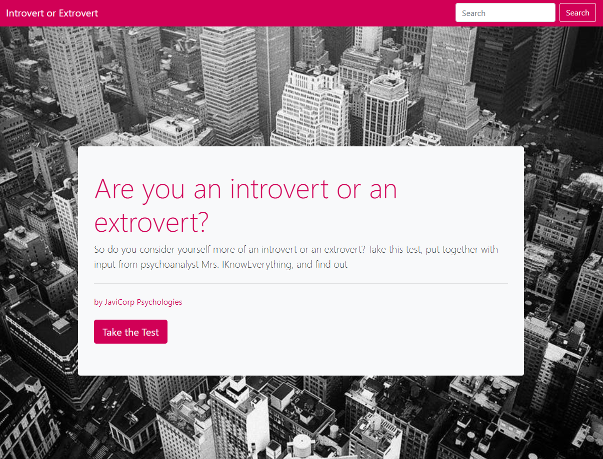
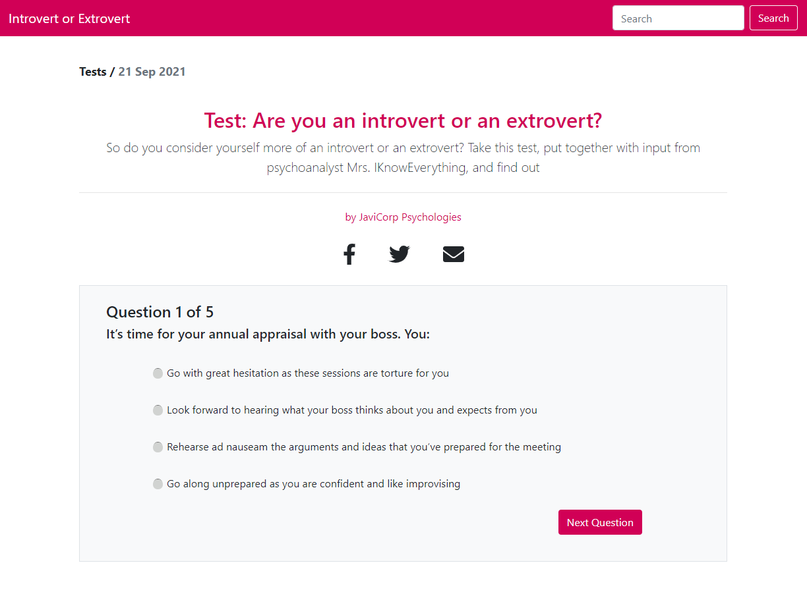

<!--
This README would normally document whatever steps are necessary to get the
application up and running.

Things you may want to c<!--
*** Thanks for checking out this README Template. If you have a suggestion that would
*** make this better, please fork the repo and create a pull request or simply open
*** an issue with the tag "enhancement".
*** Thanks again! Now go create something AMAZING! :D
-->

<!-- PROJECT SHIELDS -->
<!--
*** I'm using markdown "reference style" links for readability.
*** Reference links are enclosed in brackets [ ] instead of parentheses ( ).
*** See the bottom of this document for the declaration of the reference variables
*** for contributors-url, forks-url, etc. This is an optional, concise syntax you may use.
*** https://www.markdownguide.org/basic-syntax/#reference-style-links
-->
[![Contributors][contributors-shield]][contributors-url] 
[![Forks][forks-shield]][forks-url] 
[![Stargazers][stars-shield]][stars-url] 
[![Issues][issues-shield]][issues-url] 
 

# Introvert/Extrovert Test Django/React

>  A one page app to test if you are an introvert or an extrovert person. Frontend built with React&Redux and the backend built with Django&Django Rest Framework.

Additional description about the project and its features.

Landing Page:

Test Page:



## Built With

- DJANGO
- REACT
- REDUX
- BOOTSTRAP
- DJANGO REST FRAMEWORK
- ESLINT
- GITHUB ACTIONS
- VSCODE

## Getting Started
### Usage
To have this app on your pc, you need to:
* [download](https://github.com/javitocor/PsychologicalTest-React-Django-/archive/main.zip) or clone this repo:
  - Clone with SSH:
  ```
    git@github.com:javitocor/PsychologicalTest-React-Django-.git
  ```
  - Clone with HTTPS
  ```
    https://github.com/javitocor/PsychologicalTest-React-Django-.git
  ```

* In the project directory, you can run:

Install dependencies in your home folder with:

``` bash
   pip install -r requirements.txt
```

Run migrations:

``` bash
   py manage.py makemigrations
   py manage.py migrate
```
Seed the database:

```
  py manage.py seed
```

Go to the './frontend' folder and install the frontend dependencies:
```
  npm install
```

And then:
```
  npm build
```
Back to the home folder, run the server:

``` bash
   py manage.py runserver
```
Access the page by typing in your web browser

``` bash
   http://127.0.0.1:8000/
```
## Information about the project
### Endpoints
```
  Get all questions
    get http://127.0.0.1:8000/api/questions/
  Create a Question
    post http://127.0.0.1:8000/api/questions/
  Update a Question
    put http://127.0.0.1:8000/api/questions/:id
  Delete a question
    delete http://127.0.0.1:8000/api/questions/:id
  Get question's answer
    get http://127.0.0.1:8000/api/questions/:id/answers
  Create question's answer
    post http://127.0.0.1:8000/api/questions/:id/answers
  Delete single question's answer
    delete http://127.0.0.1:8000/api/questions/:id/answers/:id
```
### Modify questions to show
- You can modify the number of questions to show to the user by changing the number in 'pickQuestions' function at './frontend/src/containers/Test.js'. After seeding there are 14 questions with its 4 different answers, but you can add new ones using the endpoint proposed.

## Author

👤 Javier Oriol Correas Sanchez Cuesta 
- Github: [@javitocor](https://github.com/javitocor) 
- Twitter: [@JavierCorreas4](https://twitter.com/JavierCorreas4) 
- Linkedin: [Javier Oriol Correas Sanchez Cuesta](https://www.linkedin.com/in/javier-correas-sanchez-cuesta-15289482/) 

## 🤝 Contributing

Contributions, issues and feature requests are welcome!

Feel free to check the [issues page](https://github.com/javitocor/PsychologicalTest-React-Django-/issues).

## Show your support

Give a ⭐️ if you like this project!

## Acknowledgments 🚀

- [Django Docs](https://docs.djangoproject.com/en/3.2/)
- [React Docs](https://reactjs.org/docs/getting-started.html)
- [Redux Docs](https://redux.js.org/)
- [Django Rest Framework Docs](https://www.django-rest-framework.org/)
## 📝 License

This project is [MIT](lic.url) licensed.

<!-- MARKDOWN LINKS & IMAGES -->
<!-- https://www.markdownguide.org/basic-syntax/#reference-style-links -->
[contributors-shield]: https://img.shields.io/github/contributors/javitocor/PsychologicalTest-React-Django-.svg?style=flat-square
[contributors-url]: https://github.com/javitocor/PsychologicalTest-React-Django-/graphs/contributors
[forks-shield]: https://img.shields.io/github/forks/javitocor/PsychologicalTest-React-Django-.svg?style=flat-square
[forks-url]: https://github.com/javitocor/PsychologicalTest-React-Django-/network/members
[stars-shield]: https://img.shields.io/github/stars/javitocor/PsychologicalTest-React-Django-.svg?style=flat-square
[stars-url]: https://github.com/javitocor/PsychologicalTest-React-Django-/stargazers
[issues-shield]: https://img.shields.io/github/issues/javitocor/PsychologicalTest-React-Django-.svg?style=flat-square
[issues-url]: https://github.com/javitocor/PsychologicalTest-React-Django-/issuesover: